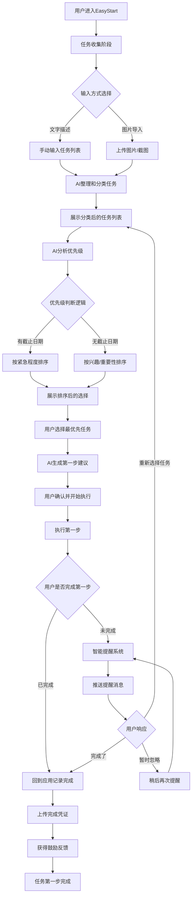

# EasyStart - ADHD任务启动助手

## 产品概述

**EasyStart** 是一款专为ADHD用户设计的任务启动助手，核心解决"启动困难"的问题。通过结构化的选择引导和AI辅助，帮助用户快速找到当下最重要的任务，并生成可执行的第一步。

你最近有什么非常想做，但没有真正去做的事。

**Slogan**: 万事开头易

## 核心功能

### 1. 任务收集与整理

- **主动引导**：通过问题引导用户列出当前可选择的任务
- **多元输入**：支持文字描述 + 图片导入（如待办清单截图、笔记等）
- **智能分类**：自动将任务按类型分类（工作/情感/自我提升等）

### 2. 优先级智能排序

- **有Deadline**：优先选择最紧急的任务
- **无Deadline**：优先选择最想做的任务
- **AI辅助决策**：分析每个任务的价值和影响，提供排序建议
- **结构化选择**：将复杂决策转化为简单的选择题

### 3. 第一步生成

- **可执行建议**：为选定任务生成具体的、可立即执行的第一步
- **最小化原则**：确保第一步足够小，降低启动阻力
- **预置模板**：提供常见任务的"Everything First Move"模板

### 4. 完成验收与激励

- **进度记录**：用户完成第一步后回来记录验收
- **凭证上传**：支持上传完成凭证（截图、照片等）
- **正向激励**：提供个性化的鼓励和成就感反馈

### 5. 主动提醒系统

- **智能触达**：当用户未完成任务时主动提醒
- **MVP实现**：浏览器通知、文本提示等轻量级提醒方式

## 用户流程图

## 使用场景示例

### 场景1：创业者的选择困难

**用户输入的任务列表：**

1. 准备明天的demo pitch
2. 做ADHD营队的直播宣传  
3. 好好休息

**AI分析结果：**

- 准备demo pitch（紧急+重要）→ 获得新创业想法验证机会
- ADHD营队宣传（重要）→ 市场需求验证
- 休息（重要）→ 保持身体健康

**推荐选择：** 准备demo pitch
**第一步建议：** 花15分钟列出demo的3个核心要点

### 场景2：日常任务管理

**引导问题：** "你最近有什么非常想做，但没有真正去做的事？"

**AI生成的选择题格式：**

- A. 学习新技能（如编程、设计）
- B. 整理房间/工作空间
- C. 联系久未联系的朋友
- D. 开始健身计划

## MVP功能范围

### MVP核心功能

- 任务收集（文字输入）
- 简单优先级排序
- 第一步建议生成
- 基础完成记录

### 提醒系统

- 浏览器通知
- 简单文本提示

### 后续迭代

- 图片识别和任务提取
- 高级AI分析
- 社交功能和分享
- 详细数据分析
